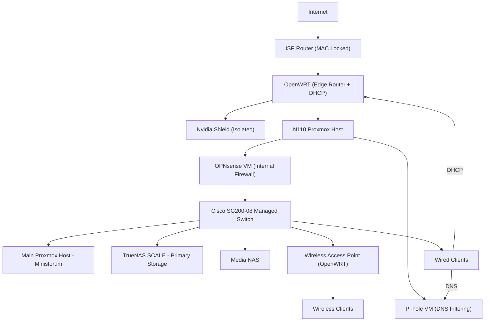

# Enterprise-Style Virtualized Infrastructure Lab

## Constraint-Driven System Design & Real-World Deployment

---

## Overview

This project documents the evolution of a self-built IT environment designed to simulate a small enterprise network supporting real users.

The infrastructure evolved through solving real operational constraints:

* ISP hardware limitations (MAC-locked router)
* Power consumption and thermal inefficiency
* Noise and environmental constraints
* Storage fragmentation and duplication
* Networking and DNS complexity
* Real-world deployment challenges

The current environment includes:

* Proxmox virtualization (multiple hosts)
* TrueNAS SCALE (ZFS storage)
* Windows Server 2022 (Active Directory + DNS)
* Ubuntu Server / Desktop
* OPNsense firewall (virtualized)
* Pi-hole DNS filtering (virtualized)
* OpenWRT edge router
* Managed switching
* Wireless Access Point (OpenWRT)
* Real-world system deployment (~13 users)

---

## Engineering Approach

**Problem → Investigation → Root Cause → Redesign → Outcome**

---

## Network Architecture

---

## Edge Design Constraint

The ISP-provided router is locked to a MAC address and cannot be replaced.

To regain control of the network:

* An OpenWRT router was deployed behind the ISP device
* OpenWRT provides DHCP and routing control
* OPNsense is used for internal firewalling and segmentation
* Consumer devices (e.g., Nvidia Shield) are intentionally isolated from the lab environment

---

## Attempted MAC Address Bypass

An attempt was made to remove the ISP router by cloning its MAC address.

Actions:

* Identified the ISP router MAC address
* Configured OpenWRT to spoof the same MAC
* Attempted direct connection to ISP

Outcome:

* Connection failed
* ISP restrictions extended beyond MAC authentication

Conclusion:

* ISP enforces additional provisioning controls
* Direct replacement of ISP hardware is not feasible

Final decision:

* Retain ISP router as entry point
* Use OpenWRT as controlled edge layer

---

## Infrastructure Evolution

### Phase 1 — Legacy Deployment & Constraints

Initial setup used repurposed hardware:

* Proxmox host (i7-4790K, 32GB RAM)
* Separate storage system

Issues:

* High power consumption
* Excessive heat
* Loud fan noise
* Inefficient continuous operation
* Storage fragmentation

---

### Phase 2 — Thermal & Airflow Optimization

Actions:

* Cleaned hardware and removed dust
* Reapplied thermal paste
* Reconfigured airflow

Root cause:

* Turbulent airflow causing heat recirculation

Outcome:

* Reduced temperature
* Improved stability
* Lower noise

**Insight:** More fans ≠ better cooling

---

### Phase 3 — Storage Consolidation (TrueNAS)

Problem:

* Data spread across multiple drives
* Duplicate files and no central control

Solution:

* Deployed TrueNAS SCALE on dedicated NAS

Actions:

* Backed up system using Rescuezilla
* Verified backup integrity
* Restored into ZFS datasets

Outcome:

* Centralized storage
* Data integrity via ZFS
* Snapshot capability

---

### Phase 4 — Network & Firewall Evolution

Progression:

* DD-WRT → OpenWRT → OPNsense

Final structure:

* OpenWRT = edge routing + DHCP
* OPNsense = internal firewall

Outcome:

* Controlled traffic flow
* Improved network visibility
* Flexible design

---

### Phase 5 — Virtualized Network Services

Deployed via Proxmox:

* OPNsense (firewall VM)
* Pi-hole (DNS filtering VM)

Outcome:

* Service isolation
* Snapshot/rollback capability
* Easier testing

---

### Phase 6 — Hardware Modernization

Problem:

* Legacy systems inefficient

Upgrade:

* Minisforum Proxmox host
* NVMe storage

Outcome:

* Reduced power usage
* Lower heat and noise
* Stable 24/7 operation

---

### Phase 7 — Active Directory & DNS

Deployed:

* Windows Server 2022 (lab.local)

Configured:

* DNS records
* DHCP integration
* Internal name resolution

Challenges resolved:

* systemd-resolved conflicts
* DNS misconfiguration

Outcome:

* Centralized identity
* Functional DNS

---

### Phase 8 — Real-World Deployment

* Reclaimed ~13 systems
* Removed legacy domain configs
* Reimaged with Linux

Use:

* Student computing
* Scratch programming

Outcome:

* Real systems supporting real users
* Hands-on support experience

---

### Phase 9 — Deployment Strategy

Goal:

* PXE-based deployment

Challenge:

* Complexity vs time

Solution:

* Parallel USB deployment

Outcome:

* Faster execution
* Reliable rollout

**Insight:** Execution > ideal automation

---

## Operations & Support Experience

Ongoing responsibilities:

* User provisioning (Active Directory)
* DNS troubleshooting
* VM resource management
* Storage access control
* Firewall and routing diagnostics

Common issues resolved:

* DNS failures
* Group policy inconsistencies
* Network communication issues
* File permission conflicts

---

## Skills Demonstrated

### Infrastructure

* Thermal optimization
* Airflow design
* Hardware evaluation

### Virtualization

* Proxmox administration
* VM lifecycle management
* Snapshots and rollback

### Storage

* TrueNAS deployment
* ZFS datasets and snapshots
* Backup and recovery

### Windows

* Active Directory
* DNS configuration

### Linux

* Ubuntu Server
* SSH administration

### Networking

* OpenWRT routing
* OPNsense firewall configuration
* DNS troubleshooting

### Deployment

* OS imaging
* Multi-system rollout
* PXE concepts

---

## Key Lessons Learned

* Infrastructure must match workload
* Legacy hardware has hidden costs
* Centralized storage is critical
* Thermal and power constraints matter
* Backup validation is essential
* Practical execution beats ideal design

---

## Future Improvements

* VLAN segmentation
* Consolidate DHCP into OPNsense
* VPN deployment
* IDS/IPS integration
* Monitoring/logging
* Domain-joined clients

---

## Summary

This project represents a full infrastructure lifecycle:

* Legacy hardware → optimized systems
* Fragmented storage → centralized architecture
* Consumer networking → controlled infrastructure design
* Manual deployment → structured rollout

**Identify problems → redesign systems → deliver working solutions**
