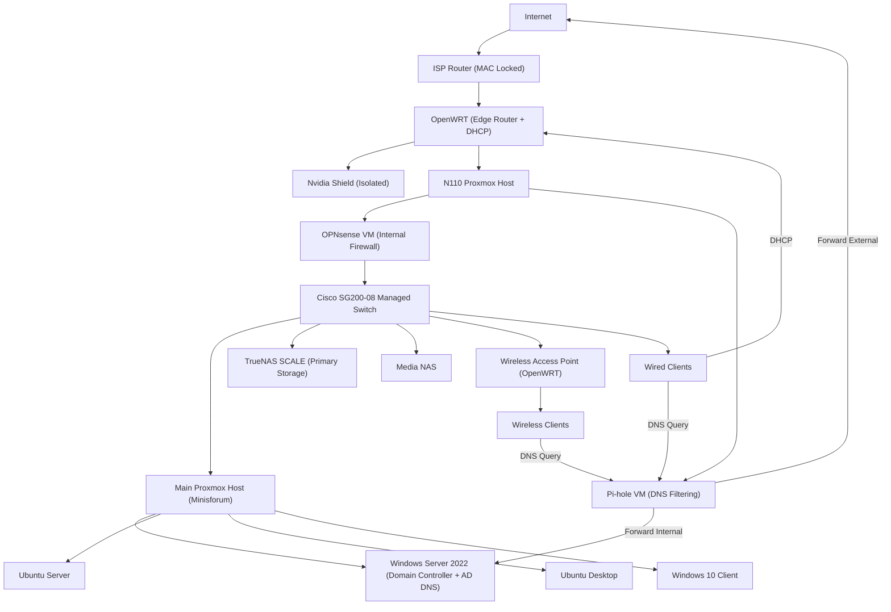

# Homelab Infrastructure Evolution

## From Constraint-Driven Design to Enterprise-Style Administration

---

## Overview

This project documents the evolution of a self-built IT environment supporting real users and services.

The infrastructure was not designed upfront. It evolved through solving real-world constraints:

- ISP router locked to a MAC address
- High power consumption and thermal inefficiency
- Storage fragmentation and duplication
- Networking and DNS complexity
- Real-world deployment and support challenges

The current environment supports ~13 active systems and includes:

- Proxmox virtualization
- TrueNAS SCALE with ZFS storage
- Windows Server 2022 with Active Directory and DNS
- Ubuntu Server and Ubuntu Desktop
- OPNsense internal firewall
- Pi-hole DNS filtering
- OpenWRT edge router and DHCP
- Managed switching
- OpenWRT wireless access point

---

## Engineering Approach

All development followed a consistent pattern:

**Problem → Investigation → Root Cause → Redesign → Outcome**

---

## Current Transitional Architecture

This diagram represents the current transitional state of the network, including ISP limitations, OpenWRT edge routing, internal firewalling, DNS filtering, and virtualized lab services.

  

  <em>Current Network Topology — Transitional Design</em>

---

## Network Architecture Note

This network is intentionally **transitional**, not fully optimized.

Key constraints:

- The ISP router cannot be removed due to MAC-level provisioning
- OpenWRT is used to regain control over routing and DHCP
- OPNsense operates as an internal firewall rather than the primary edge firewall
- Pi-hole provides DNS filtering, while Active Directory DNS remains authoritative for the domain

This results in overlapping responsibilities that are functional but not ideal.

Planned improvement:

- Consolidate routing, DHCP, and firewall control into OPNsense
- Simplify the network control plane
- Introduce VLAN-based segmentation

---

## Attempted MAC Address Bypass

An attempt was made to eliminate the ISP router:

- Cloned ISP router MAC address onto OpenWRT
- Attempted direct connection to ISP

Result:

- Connection failed
- ISP enforces additional provisioning controls beyond MAC

Conclusion:

- ISP router must remain in place

---

## Infrastructure Evolution

### Phase 1 — Legacy Deployment

- Repurposed desktop hardware: i7-4790K, 32GB RAM
- Separate storage system

Problems:

- High power consumption
- Excessive heat and noise
- Fragmented storage

---

### Phase 2 — Thermal Optimization

- Cleaned dust and components
- Reapplied thermal paste
- Reworked airflow

Outcome:

- Improved cooling and stability

**Insight:** More fans does not always mean better cooling.

---

### Phase 3 — Storage Consolidation

Problem:

- Data spread across multiple drives
- Duplicate files
- No single source of truth

Solution:

- Deployed TrueNAS SCALE

Outcome:

- Centralized storage
- ZFS snapshots and integrity
- More organized data management

---

### Phase 4 — Network Evolution

Progression:

- DD-WRT
- OpenWRT
- OPNsense

Final roles:

- OpenWRT: DHCP and edge routing
- OPNsense: internal firewall

---

### Phase 5 — Virtualized Services

Services deployed:

- OPNsense VM
- Pi-hole VM

Outcome:

- Service isolation
- Snapshot and rollback capability
- Easier testing and recovery

---

### Phase 6 — Hardware Modernization

- Migrated to Minisforum host
- Added NVMe storage

Outcome:

- Lower power usage
- Reduced heat and noise
- Stable 24/7 operation

---

### Phase 7 — Active Directory

- Deployed Windows Server 2022 with `lab.local`
- Configured domain services and DNS

Outcome:

- Centralized identity management
- Internal DNS resolution for domain services

---

### Phase 8 — Real-World Deployment

- Reclaimed ~13 systems
- Reimaged and deployed

Use:

- Student computing

Outcome:

- Real users supported
- Practical troubleshooting experience

---

### Phase 9 — Deployment Strategy

Attempt:

- PXE deployment

Final solution:

- Parallel USB deployment

**Insight:** Execution is more important than perfect automation.

---

## Operations & Support Experience

- User provisioning through Active Directory
- DNS troubleshooting using Pi-hole and AD DNS
- VM resource management
- Storage permissions and access control
- Network and firewall diagnostics

Common issues resolved:

- DNS misconfiguration
- Group policy inconsistencies
- Connectivity issues
- File permission conflicts

---

## Skills Demonstrated

### Infrastructure

- Thermal optimization
- Hardware evaluation
- Right-sizing hardware for workload

### Virtualization

- Proxmox administration
- VM lifecycle management
- Snapshots and rollback

### Storage

- TrueNAS deployment
- ZFS management
- Backup and recovery

### Windows

- Active Directory
- DNS configuration
- Domain controller deployment

### Linux

- Ubuntu Server
- Ubuntu Desktop
- SSH administration

### Networking

- OpenWRT routing
- OPNsense firewall configuration
- DNS flow design
- Managed switching

### Deployment

- OS imaging
- Multi-system rollout
- PXE concepts

---

## Key Lessons Learned

- Real systems evolve under constraints
- Legacy hardware introduces hidden costs
- Centralized storage is critical
- DNS design must align with Active Directory
- Infrastructure simplicity improves reliability
- Execution matters more than ideal design

---

## Future Improvements

- VLAN segmentation
- Consolidate DHCP and routing into OPNsense
- VPN deployment
- IDS/IPS integration
- Monitoring and logging

---

## Summary

This project represents a full infrastructure lifecycle:

- Legacy hardware → optimized systems
- Fragmented storage → centralized architecture
- Mixed networking → controlled infrastructure design
- Manual deployment → structured rollout

**Identify problems → redesign systems → deliver working solutions**
