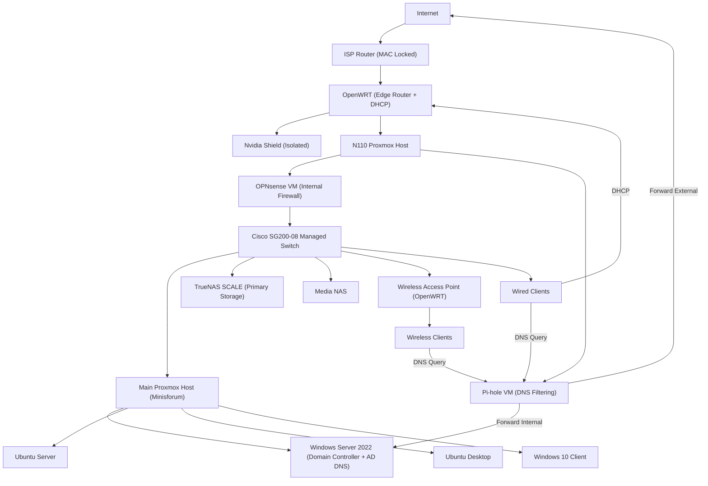

# Enterprise-Style Virtualized Infrastructure Lab

## Constraint-Driven System Design & Real-World Deployment

---

## Overview

This project documents the evolution of a self-built IT environment designed to simulate a small enterprise network supporting real users.

The infrastructure was developed by solving real-world constraints rather than following a predefined design:

* ISP router locked to a MAC address
* High power consumption and thermal inefficiency from legacy hardware
* Storage fragmentation and duplication
* Networking and DNS complexity
* Real-world deployment and support challenges

The current environment supports ~13 active users and includes:

* Proxmox virtualization (multiple hosts)
* TrueNAS SCALE (ZFS storage)
* Windows Server 2022 (Active Directory + DNS)
* Ubuntu Server / Desktop
* OPNsense firewall (virtualized)
* Pi-hole DNS filtering
* OpenWRT edge router
* Managed switching
* Wireless Access Point (OpenWRT)

---

## Engineering Approach

All development followed a consistent pattern:

**Problem → Investigation → Root Cause → Redesign → Outcome**

---

## Network Architecture

---

## Edge Design Constraint

The ISP-provided router is locked to a MAC address and cannot be replaced.

To regain control over the network:

* OpenWRT was deployed behind the ISP router
* OpenWRT provides DHCP and edge routing
* OPNsense is used for internal firewalling and segmentation
* Consumer devices (e.g., Nvidia Shield) are intentionally isolated from lab infrastructure

---

## Attempted MAC Address Bypass

An attempt was made to remove the ISP router by cloning its MAC address.

Actions:

* Identified the ISP router MAC address
* Configured OpenWRT to spoof the MAC
* Attempted direct ISP connection

Outcome:

* Connection failed
* ISP restrictions extend beyond MAC authentication

Conclusion:

* ISP enforces additional provisioning controls
* ISP router must remain in place

---

## Infrastructure Evolution

### Phase 1 — Legacy Deployment & Constraints

* Repurposed hardware (i7-4790K, 32GB RAM)
* Separate storage system

Issues:

* High power consumption
* Excessive heat
* Loud fan noise
* Fragmented storage

---

### Phase 2 — Thermal & Airflow Optimization

Actions:

* Cleaned dust and debris
* Reapplied thermal paste
* Reconfigured airflow

Outcome:

* Reduced temperature
* Improved stability

**Insight:** More fans ≠ better cooling

---

### Phase 3 — Storage Consolidation (TrueNAS)

Problem:

* Data spread across multiple drives
* Duplicate files

Solution:

* Deployed TrueNAS SCALE

Actions:

* Backed up system using Rescuezilla
* Verified backups
* Restored into ZFS

Outcome:

* Centralized storage
* Data integrity and snapshots

---

### Phase 4 — Network & Firewall Evolution

Progression:

* DD-WRT → OpenWRT → OPNsense

Final roles:

* OpenWRT → DHCP + edge routing
* OPNsense → internal firewall

---

### Phase 5 — Virtualized Network Services

* OPNsense (firewall VM)
* Pi-hole (DNS filtering VM)

Outcome:

* Service isolation
* Snapshot and rollback capability

---

### Phase 6 — Hardware Modernization

Upgrade:

* Minisforum Proxmox host
* NVMe storage

Outcome:

* Lower power consumption
* Reduced heat and noise
* Stable 24/7 operation

---

### Phase 7 — Active Directory & DNS

Deployed:

* Windows Server 2022 (lab.local)

Configured:

* Domain services
* DNS records
* Client integration

Outcome:

* Centralized identity
* Functional internal DNS

---

### Phase 8 — Real-World Deployment

* Reclaimed ~13 systems
* Reimaged and redeployed

Use:

* Student computing

Outcome:

* Real users supported
* Practical troubleshooting experience

---

### Phase 9 — Deployment Strategy

Attempted:

* PXE deployment

Final solution:

* Parallel USB imaging

**Insight:** Execution > ideal automation

---

## Operations & Support Experience

* User provisioning (Active Directory)
* DNS troubleshooting
* VM resource management
* Storage access control
* Firewall and routing diagnostics

Common issues resolved:

* DNS misconfiguration
* Group policy inconsistencies
* Network communication failures
* File permission conflicts

---

## Skills Demonstrated

### Infrastructure

* Thermal optimization
* Hardware efficiency evaluation

### Virtualization

* Proxmox administration
* VM lifecycle management
* Snapshots and rollback

### Storage

* TrueNAS deployment
* ZFS management
* Backup and recovery

### Windows

* Active Directory
* DNS configuration

### Linux

* Ubuntu Server
* SSH administration

### Networking

* OpenWRT routing
* OPNsense firewall configuration
* DNS flow design

### Deployment

* OS imaging
* Multi-system rollout

---

## Key Lessons Learned

* Infrastructure must match workload
* Legacy hardware has hidden costs
* Centralized storage is critical
* DNS design must align with Active Directory
* Backup validation is essential
* Practical execution often outweighs ideal design

---

## Future Improvements

* VLAN segmentation and isolation
* Consolidate routing/DHCP into OPNsense
* VPN deployment
* IDS/IPS integration
* Monitoring and logging systems

---

## Summary

This project represents a full infrastructure lifecycle:

* Legacy hardware → optimized systems
* Fragmented storage → centralized architecture
* Consumer networking → controlled infrastructure design
* Manual deployment → structured rollout

**Identify problems → redesign systems → deliver working solutions**
