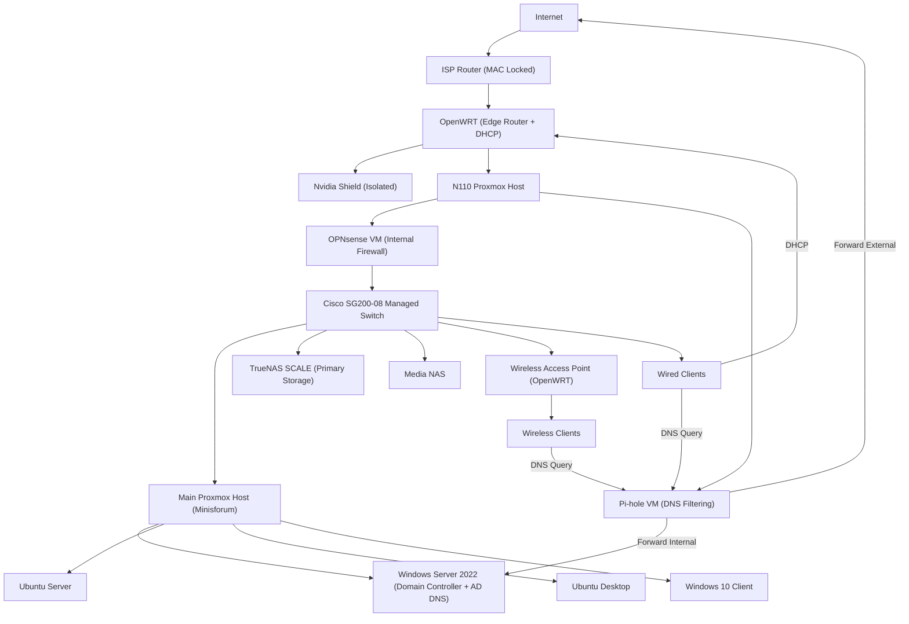

# Homelab Infrastructure Evolution

## From Constraint-Driven Design to Operational Infrastructure

---

## Overview

Built and operated a multi-system environment supporting ~13 active systems and real users.

This infrastructure was not pre-designed. It evolved through solving real constraints:

- ISP router locked to a MAC address (loss of network control)
- High power consumption and thermal instability from legacy hardware
- Fragmented storage with no single source of truth
- DNS conflicts between filtering and Active Directory
- Real deployment and support demands from actual users

The current environment includes:

- Proxmox virtualization
- TrueNAS SCALE with ZFS storage
- Windows Server 2022 (Active Directory + DNS)
- Ubuntu Server / Desktop
- Windows 10 client systems
- OPNsense internal firewall
- Pi-hole DNS filtering
- OpenWRT edge router and DHCP
- Cisco SG200-08 managed switch
- OpenWRT wireless access point

This environment is actively used and maintained, not simulated.

---

## Engineering Approach

All development followed:

**Problem → Decision → Result**

Focus: regain control, reduce instability, and maintain usable systems under constraints.

---

## Current Transitional Architecture

  

  <em>Current Network Topology — Transitional Design</em>

---

## Network Architecture (Transitional by Design)

**Problem:**  
Loss of control due to ISP restrictions and overlapping network responsibilities.

**Decision:**  
- Retain ISP router (non-removable constraint)  
- Use OpenWRT for routing and DHCP  
- Deploy OPNsense internally for firewall control  
- Use Pi-hole while preserving AD DNS authority  

**Result:**  
- Restored internal network control  
- Enabled safe testing without breaking core services  
- Accepted temporary complexity for control  

---

## Edge Constraint & Failed Bypass

**Problem:**  
ISP router prevented direct network control.

**Attempt:**  
- Cloned MAC address to OpenWRT  
- Attempted direct ISP connection  

**Result:**  
- Connection failed (ISP enforces additional controls)  

**Conclusion:**  
- ISP router must remain  
- OpenWRT used behind ISP for control  

---

## Core Compute (Proxmox)

**Problem:**  
Need to manage multiple systems across Windows and Linux reliably.

**Decision:**  
Centralize compute using Proxmox VMs.

**Result:**  
- Controlled multi-system environment  
- Real troubleshooting across OS, DNS, and networking  

---

## DNS Flow Design

**Problem:**  
DNS conflict between filtering and Active Directory.

**Decision:**  
- Clients → Pi-hole  
- Internal queries → AD DNS  
- External queries → upstream  

**Result:**  
- Filtering preserved  
- AD functionality maintained  
- DNS conflicts eliminated  

---

## Infrastructure Evolution

### Phase 1 — Legacy Deployment
**Problem:** Heat, noise, inefficiency  
**Result:** Functional but unstable

---

### Phase 2 — Thermal Optimization
**Decision:** Clean hardware, improve airflow, reapply thermal paste  
**Result:** Improved stability  

---

### Phase 3 — Storage Consolidation
**Problem:** Data fragmentation  
**Decision:** Deploy TrueNAS  
**Result:** Centralized storage  

---

### Phase 4 — Media Separation
**Decision:** Separate critical vs media storage  
**Result:** Reduced load and improved organization  

---

### Phase 5 — Hardware Migration
**Problem:** Legacy hardware unsuitable for 24/7 use  
**Decision:** Backup → verify → migrate → restore  
**Result:** Stable, efficient system  

---

### Phase 6 — Network Evolution
**Problem:** Flat network, limited control  
**Decision:** Split roles (OpenWRT / OPNsense / Pi-hole)  
**Result:** Improved control and visibility  

---

### Phase 7 — Virtualized Services
**Decision:** Run firewall and DNS as VMs  
**Result:** Snapshot, rollback, and recovery capability  

---

### Phase 8 — Rack Right-Sizing
**Problem:** Overbuilt system increased heat and noise  
**Decision:** Downsize infrastructure  
**Result:** Reduced overhead  

---

### Phase 9 — Hardware Modernization
**Decision:** Use compact, efficient hardware  
**Result:** Stable 24/7 operation  

---

### Phase 10 — Active Directory
**Decision:** Deploy AD (`lab.local`)  
**Result:** Centralized identity and DNS  

---

### Phase 11 — Real-World Deployment
**Problem:** Need real users, not just lab systems  
**Decision:** Deploy ~13 systems  
**Result:** Real support and troubleshooting experience  

---

### Phase 12 — Deployment Strategy
**Problem:** PXE complexity vs time constraints  
**Decision:** USB parallel deployment  
**Result:** Faster, reliable rollout  

---

## Operations & Support

- Active Directory provisioning  
- DNS troubleshooting  
- VM management  
- Network diagnostics  

**Issues resolved:**
- DNS failures  
- Connectivity issues  
- Permission conflicts  

---

## Key Lessons

- Systems evolve under constraints  
- DNS is critical for stability  
- Simplicity improves reliability  
- Execution > ideal design  

---

## Future Improvements

- VLAN segmentation  
- OPNsense consolidation  
- Monitoring and logging  
- Backup automation  

---

## Summary

- Constraint → redesign → stability  
- Fragmentation → control  
- Lab → real operational system  

**Identify problems → make decisions → restore functionality**
