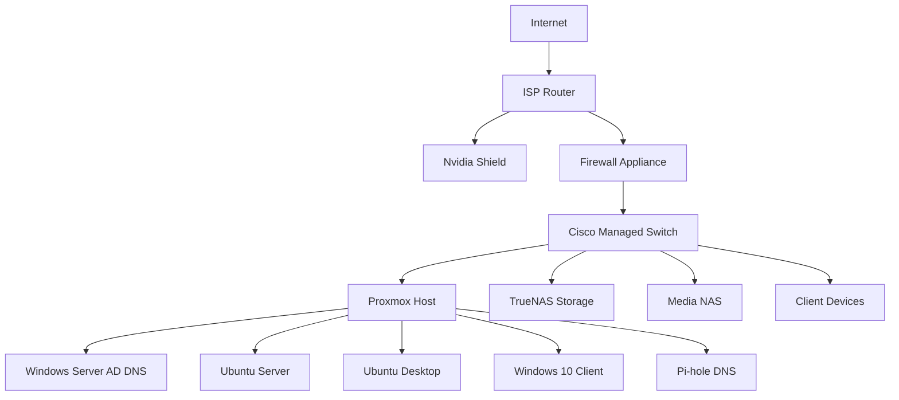

# Enterprise-Style Virtualized Infrastructure Lab

## Constraint-Driven System Design & Real-World Deployment

---

## Overview

This project documents the evolution of a self-built IT environment designed to simulate a small enterprise network supporting real users.

The infrastructure evolved through solving real operational constraints:

* Power consumption
* Thermal inefficiency
* Noise and environmental limitations
* Storage fragmentation
* Networking and DNS complexity
* Deployment challenges

The current environment includes:

* Proxmox virtualization
* TrueNAS SCALE (ZFS storage)
* Windows Server 2022 (Active Directory + DNS)
* Ubuntu Server / Desktop
* OPNsense firewall
* Pi-hole DNS filtering
* Managed switching
* Real-world system deployment (~13 users)

---

## Engineering Approach

**Problem → Investigation → Root Cause → Redesign → Outcome**

---

## Network Architecture

---

## Infrastructure Evolution

### Phase 1 — Legacy Deployment & Initial Constraints

Initial setup used repurposed hardware:

* Proxmox host (i7-4790K, 32GB RAM)
* Separate NAS system

Key issues:

* High power consumption
* Excessive heat
* Loud fan noise
* Inefficient 24/7 operation
* Storage fragmented across multiple devices

---

### Phase 2 — Thermal & Airflow Optimization

Actions:

* Cleaned hardware and removed dust buildup
* Reapplied thermal paste
* Reconfigured airflow

Root cause identified:

* Turbulent airflow causing heat recirculation

Outcome:

* Lower temperatures
* Improved stability
* Reduced noise

**Key insight:** More fans ≠ better cooling

---

### Phase 3 — Storage Consolidation (TrueNAS)

Problem:

* No centralized storage
* Duplicate data across drives

Solution:

* Deployed TrueNAS SCALE on UGREEN NAS

Actions:

* Backed up system using Rescuezilla
* Verified disk images before migration
* Restored data into ZFS datasets

Outcome:

* Single source of truth
* Improved data integrity
* Snapshot capability

---

### Phase 4 — Firewall & Network Evolution

Progression:

* DD-WRT → OpenWRT → OPNsense

Final architecture:

* Dedicated firewall appliance (multi-NIC)
* OPNsense virtualized under Proxmox

Skills developed:

* Interface mapping
* Routing
* Firewall rule design

Outcome:

* Controlled network traffic
* Improved visibility and flexibility

---

### Phase 5 — Virtualized Services

Shifted from hardware-based services to virtualization:

* OPNsense (firewall VM)
* Pi-hole (DNS filtering VM)

Outcome:

* Service isolation
* Snapshot and rollback capability
* Increased flexibility

---

### Phase 6 — Hardware Migration & Modernization

Problem:

* Legacy systems inefficient for continuous operation

Upgrade:

* Minisforum mini PC (Proxmox host)
* NVMe storage

Outcome:

* Reduced power consumption
* Lower heat and noise
* Stable 24/7 environment

---

### Phase 7 — Active Directory & Internal DNS

Deployed:

* Windows Server 2022 (lab.local domain)

Configured:

* DNS records
* DHCP integration
* Client resolution via AD DNS

Challenges resolved:

* systemd-resolved conflicts
* DNS misconfiguration

Outcome:

* Functional internal DNS
* Centralized authentication

---

### Phase 8 — Real-World Deployment

* Reclaimed ~13 decommissioned systems
* Removed legacy domain configurations
* Reimaged using Linux (Zorin OS)

Used for:

* Student computing
* Scratch programming

Outcome:

* Real systems deployed to real users
* Practical support experience

---

### Phase 9 — Deployment Strategy (PXE vs Manual)

Goal:

* Automate OS deployment via PXE

Challenges:

* Configuration complexity
* Time constraints

Final solution:

* Parallel USB deployment (Balena Etcher)

Outcome:

* Faster execution
* Successful rollout

**Key insight:** Execution > ideal automation

---

## Operations & Support Experience

This environment required ongoing management:

* User account provisioning (Active Directory)
* DNS troubleshooting
* VM performance management
* Storage access control
* Firewall and routing diagnostics

Common issues resolved:

* DNS failures
* Group policy inconsistencies
* Network communication issues
* File permission conflicts

---

## Skills Demonstrated

### Infrastructure & Hardware

* Thermal optimization
* Airflow design
* Hardware efficiency evaluation

### Virtualization

* Proxmox management
* VM lifecycle control
* Snapshot and rollback

### Storage

* TrueNAS deployment
* ZFS datasets and snapshots
* Backup and recovery

### Windows Systems

* Active Directory
* DNS configuration

### Linux

* Ubuntu Server
* SSH administration

### Networking

* Firewall configuration (OPNsense)
* Routing and DNS troubleshooting

### Deployment

* PXE concepts
* OS imaging
* Multi-system rollout

---

## Key Lessons Learned

* Infrastructure must match workload requirements
* Legacy hardware introduces hidden operational costs
* Centralized storage is critical for data integrity
* Thermal and power constraints directly impact system design
* Backup validation is essential before system changes
* Practical execution often outweighs ideal design

---

## Future Improvements

* VLAN segmentation and traffic isolation
* VPN deployment
* IDS/IPS integration
* Monitoring and logging systems
* Domain-joined client expansion

---

## Summary

This project represents a full infrastructure lifecycle:

* Legacy hardware → optimized systems
* Scattered storage → centralized architecture
* Consumer networking → controlled firewall design
* Manual deployment → structured rollout strategy

**Identify problems → redesign systems → deliver working solutions**
