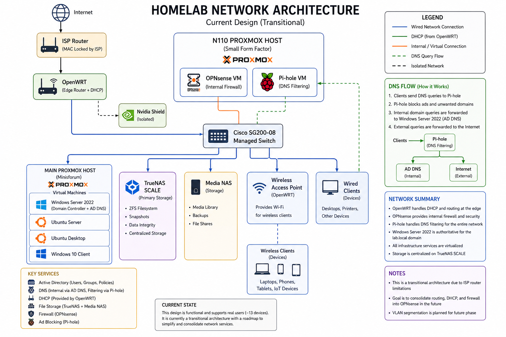
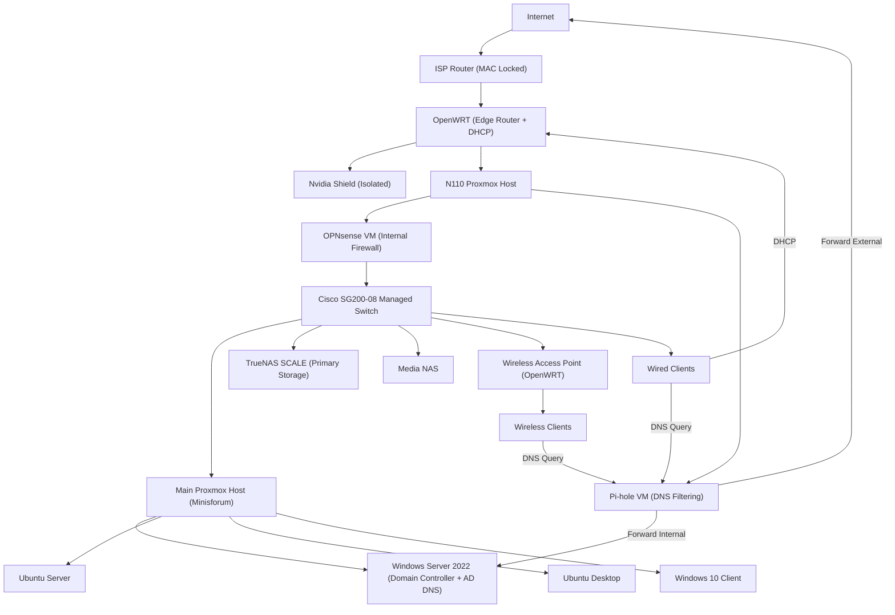

# Homelab Infrastructure Evolution

## From Constraint-Driven Design to Enterprise-Style Administration

---

## Overview

This project documents the evolution of a self-built IT environment supporting real users and services.

The infrastructure was not designed upfront. It evolved through solving real-world constraints:

- ISP router locked to a MAC address
- High power consumption and thermal inefficiency
- Storage fragmentation and duplication
- Networking and DNS complexity
- Real-world deployment and support challenges

The current environment supports ~13 active systems and includes:

- Proxmox virtualization
- TrueNAS SCALE with ZFS storage
- Windows Server 2022 with Active Directory and DNS
- Ubuntu Server
- Ubuntu Desktop
- Windows 10 client
- OPNsense internal firewall
- Pi-hole DNS filtering
- OpenWRT edge router and DHCP
- Cisco SG200-08 managed switch
- OpenWRT wireless access point
- Real-world system deployment and support

This environment is actively used and maintained, not just simulated.

---

## Engineering Approach

All development followed a consistent pattern:

**Problem → Investigation → Root Cause → Redesign → Outcome**

---

## Current Transitional Architecture

This diagram represents the current transitional state of the network, including ISP limitations, OpenWRT edge routing, internal firewalling, DNS filtering, managed switching, wireless access, and virtualized lab services.

  

  <em>Current Network Topology — Transitional Design</em>

---

## Network Architecture Note

This network is intentionally **transitional**, not fully optimized.

Key constraints:

- The ISP router cannot be removed due to MAC-level provisioning
- OpenWRT is used to regain control over routing and DHCP
- OPNsense operates as an internal firewall rather than the primary edge firewall
- Pi-hole provides DNS filtering, while Active Directory DNS remains authoritative for the domain

This results in overlapping responsibilities that are functional but not ideal.

Planned improvement:

- Consolidate routing, DHCP, and firewall control into OPNsense
- Simplify the network control plane
- Introduce VLAN-based segmentation

---

## Edge Design Constraint

The ISP-provided router is locked to the provider environment and could not be removed cleanly.

To regain control over the network:

- OpenWRT was deployed behind the ISP router
- OpenWRT provides DHCP and edge routing
- OPNsense is used for internal firewalling and segmentation
- Consumer devices, such as the Nvidia Shield, are intentionally isolated from the lab environment to avoid disruption from testing and changes

This design is functional, but it creates overlapping responsibilities between OpenWRT and OPNsense. That overlap is understood and documented as part of the future cleanup plan.

---

## Attempted MAC Address Bypass

An attempt was made to eliminate the ISP router:

- Cloned ISP router MAC address onto OpenWRT
- Attempted direct connection to ISP

Result:

- Connection failed
- ISP enforces additional provisioning controls beyond MAC authentication

Conclusion:

- ISP router must remain in place
- OpenWRT remains the controllable edge layer behind the ISP device

---

## Core Compute: Main Proxmox Host

The primary Proxmox host runs multiple virtual machines that support the lab environment:

- Windows Server 2022: Domain Controller and Active Directory DNS
- Ubuntu Server
- Ubuntu Desktop
- Windows 10 client

These systems are used for testing, administration, troubleshooting, and real-world deployment scenarios.

This is an important part of the lab because it demonstrates more than installing tools. It shows the ability to operate multiple systems, manage services, and troubleshoot interactions between Windows, Linux, DNS, virtualization, and networking.

---

## DNS Flow Design

Client devices use Pi-hole as the primary DNS filtering layer.

DNS flow:

- Clients send DNS queries to Pi-hole
- Pi-hole filters DNS requests for ad blocking and tracking protection
- Internal domain queries for `lab.local` are forwarded to Active Directory DNS
- External queries are forwarded upstream

This allows the network to keep DNS filtering in place while still preserving Active Directory functionality.

Design logic:

- Pi-hole handles filtering
- Active Directory DNS remains authoritative for the domain
- Clients benefit from filtering without breaking domain resolution

---

## Wireless Access Point

A Linksys device was flashed with OpenWRT and repurposed as a wireless access point.

Its role:

- Provides wireless access to the network
- Operates as an access point, not as the main router
- Extends network access without replacing the edge router or internal firewall

This separates wireless access from routing and firewall responsibilities.

---

## Consumer Device Isolation

The Nvidia Shield is connected through OpenWRT rather than being placed inside the lab environment.

Reason:

- The device is used for media streaming
- It should remain stable
- It should not be affected by firewall testing, DNS experiments, VLAN changes, or lab instability

This is an intentional separation between stable consumer devices and experimental lab infrastructure.

---

## Infrastructure Evolution

### Phase 1 — Legacy Deployment

The lab began with repurposed desktop hardware:

- Proxmox host: i7-4790K, 32GB RAM
- Separate storage system
- Legacy hardware reused to reduce cost

Problems:

- High power consumption
- Excessive heat
- Loud fan noise
- Inefficient continuous operation
- Fragmented storage

The original setup worked, but it was inefficient for 24/7 operation.

---

### Phase 2 — Thermal Optimization

Actions taken:

- Cleaned dust from systems and components
- Reapplied CPU thermal paste
- Reworked airflow
- Evaluated fan placement and case airflow

Outcome:

- Improved cooling
- Better system stability
- Reduced thermal stress

Insight:

**More fans does not always mean better cooling.**

The issue was not just the number of fans. It was airflow direction, turbulence, and heat recirculation.

---

### Phase 3 — Storage Consolidation

Problem:

- Data was spread across multiple hard drives
- USB drives contained copies of copies
- Files were moved between home and work manually
- There was no single source of truth

Solution:

- Deployed TrueNAS SCALE
- Consolidated files into centralized storage
- Began manual deduplication and cleanup

Outcome:

- Centralized storage
- Better organization
- ZFS snapshots and integrity
- Reduced file duplication
- Clearer data management

This phase started because the storage problem was real. The goal was not just to build a NAS. The goal was to stop data sprawl.

---

### Phase 4 — Media Storage Separation

A second NAS was added for media storage.

Reason:

- Media files are less critical
- Original Blu-ray discs are available as backup
- Media streaming should not consume primary storage resources
- Important files and recoverable media should not be treated the same

Final separation:

- Primary NAS: important files and structured data
- Media NAS: movies and media streaming

Outcome:

- Better workload separation
- Cleaner storage design
- Reduced load on primary storage

---

### Phase 5 — TrueNAS Hardware Migration

The original TrueNAS system ran on legacy hardware.

Problems:

- Loud operation
- High heat output
- Poor fit for office use
- Inefficient 24/7 operation

Actions:

- Acquired UGREEN NAS hardware
- Backed up the system using Rescuezilla
- Verified the backup
- Installed TrueNAS SCALE on the UGREEN NAS
- Migrated storage services to the new hardware

Outcome:

- Lower noise
- Better power efficiency
- Better form factor
- More reliable storage platform

This was a real migration workflow: backup, verify, reinstall, restore, and validate.

---

### Phase 6 — Network Evolution

The network evolved through several stages:

- DD-WRT
- OpenWRT
- OPNsense

Final current roles:

- OpenWRT: edge routing and DHCP
- OPNsense: internal firewall
- Pi-hole: DNS filtering
- Active Directory DNS: authoritative DNS for `lab.local`

Outcome:

- More control than the ISP router alone
- Better visibility
- More flexible network design
- Clearer separation between edge routing, internal firewalling, and DNS filtering

---

### Phase 7 — Virtualized Network Services

Network services were virtualized on the N110 Proxmox host.

Services deployed:

- OPNsense VM
- Pi-hole VM

Outcome:

- Service isolation
- Snapshot and rollback capability
- Easier testing
- Easier recovery
- Better use of small-form-factor hardware

This also created complexity, which is why the architecture is documented as transitional rather than final.

---

### Phase 8 — Rack Attempt and Right-Sizing

An 18U rack was introduced to consolidate equipment.

Problem:

- The rack was physically large
- Legacy systems created high heat
- Noise increased significantly
- The office environment became uncomfortable
- Power usage was too high for the workload

Conclusion:

- Larger infrastructure is not automatically better
- The setup was overbuilt for the actual need
- The infrastructure needed to be right-sized

Redesign decision:

- Move away from large legacy hardware
- Use smaller, efficient systems
- Separate compute and storage roles clearly

---

### Phase 9 — Hardware Modernization

The lab was modernized with smaller and more efficient hardware.

Upgrades:

- Minisforum system for the main Proxmox host
- UGREEN NAS systems for storage
- NVMe storage
- Smaller form factor equipment

Outcome:

- Lower power usage
- Reduced heat
- Reduced noise
- Better office fit
- More stable 24/7 operation

This phase was not just an upgrade. It was a correction of earlier design inefficiencies.

---

### Phase 10 — Active Directory

Windows Server 2022 was deployed as a domain controller.

Configuration:

- Domain: `lab.local`
- Active Directory Domain Services
- AD-integrated DNS
- Internal domain resolution

Outcome:

- Centralized identity management
- Internal DNS resolution for domain services
- Better understanding of Windows Server administration
- Foundation for future domain-joined clients and Group Policy work

---

### Phase 11 — Real-World Deployment

Approximately 13 systems were reclaimed, reimaged, and deployed for real use.

Actions:

- Reclaimed decommissioned systems
- Removed old configurations
- Reimaged systems
- Prepared machines for student use

Use case:

- Student computing
- Scratch programming
- Real user access

Outcome:

- Real users supported
- Practical troubleshooting experience
- Real deployment experience beyond lab simulation

This is one of the strongest parts of the project because the systems were used by actual users, not just created for screenshots.

---

### Phase 12 — Deployment Strategy

Initial attempt:

- PXE deployment

Challenge:

- PXE setup added complexity
- Time constraints mattered
- Perfect automation was not the best immediate solution

Final solution:

- Parallel USB deployment

Outcome:

- Faster rollout
- Reliable deployment
- Systems delivered for real use

Insight:

**Execution is more important than perfect automation.**

---

## Operations & Support Experience

This environment required ongoing support and administration.

Responsibilities included:

- User provisioning through Active Directory
- DNS troubleshooting using Pi-hole and AD DNS
- VM resource management
- Storage permissions and access control
- Network and firewall diagnostics
- System imaging and deployment
- Hardware troubleshooting
- Managing real systems used by real users

Common issues resolved:

- DNS misconfiguration
- Group Policy inconsistencies
- Connectivity issues
- File permission conflicts
- System imaging problems
- Hardware limitations
- Network service conflicts

---

## Skills Demonstrated

### Infrastructure

- Thermal optimization
- Hardware evaluation
- Right-sizing hardware for workload
- Power and heat constraint analysis
- Equipment lifecycle decisions

### Virtualization

- Proxmox administration
- VM lifecycle management
- Snapshots and rollback
- Virtualized network services
- Multi-OS lab design

### Storage

- TrueNAS SCALE deployment
- ZFS management
- Backup and recovery
- Storage consolidation
- Dataset organization
- Separation of critical and non-critical storage

### Windows

- Windows Server 2022
- Active Directory
- Domain controller deployment
- AD DNS configuration
- Internal DNS resolution

### Linux

- Ubuntu Server
- Ubuntu Desktop
- SSH administration
- Linux imaging and deployment
- Basic Linux troubleshooting

### Networking

- OpenWRT routing
- DHCP design
- OPNsense firewall configuration
- DNS flow design
- Pi-hole DNS filtering
- Managed switching
- Wireless access point configuration
- Transitional architecture documentation

### Deployment

- OS imaging
- Multi-system rollout
- PXE concepts
- USB imaging
- Real-world device deployment

---

## Key Lessons Learned

- Real systems evolve under constraints
- Legacy hardware introduces hidden costs
- Bigger infrastructure is not always better
- Centralized storage is critical
- Critical and non-critical data should be separated
- DNS design must align with Active Directory
- Infrastructure simplicity improves reliability
- Backup validation matters before migration
- Thermal design matters
- Execution matters more than ideal design

---

## Future Improvements

- VLAN segmentation
- Consolidate DHCP and routing into OPNsense
- Simplify the control plane
- VPN deployment
- IDS/IPS integration
- Monitoring and logging
- Domain-joined client expansion
- More formal firewall rule documentation
- Backup automation
- Disaster recovery testing

---

## Summary

This project represents a full infrastructure lifecycle:

- Legacy hardware → optimized systems
- Fragmented storage → centralized architecture
- Mixed networking → controlled infrastructure design
- Large inefficient hardware → right-sized systems
- Manual deployment → structured rollout
- Simulated lab work → real systems supporting real users

**Identify problems → redesign systems → deliver working solutions**
